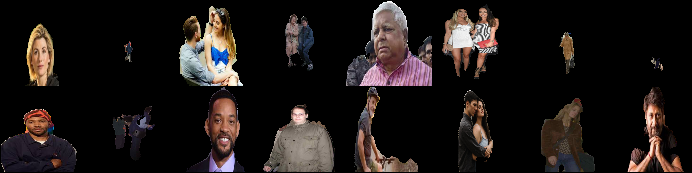

# Pix2Pix Image Segmentation

This project aims to perform image segmentation on human images by generating a mask using a Pix2Pix GAN. The generated mask is then applied to segment the person from the image. *Note: This project was a successful experiment using the Pix2Pix architecture.*

## Results


Input Image


Output Image

## Project Overview

The goal of this project is to segment human images by predicting a binary mask for each image. This mask can be used to isolate the human subject from the background, enhancing image-editing tasks and simplifying further processing steps. The approach uses Pix2Pix GAN architecture with minor modifications for input and output heads to accommodate the segmentation task.

## Model Architecture

- **Pix2Pix GAN**: Used as the core architecture without any major changes, with input and output heads set to 3 and 1 channels, respectively.
- **Generator**: Trains to generate accurate masks of human subjects.
- **Discriminator**: Evaluates the generated masks by distinguishing them from real mask data.

## Data

- **Dataset**: [Human Segmentation Dataset](https://github.com/VikramShenoy97/Human-Segmentation-Dataset/)
- **Preprocessing**: No preprocessing was applied to the dataset before training.

## Training Configuration

- **Training ID**: Each session is uniquely identified for organized storage of results and logs.
- **Hyperparameters**:
  - **Epochs**: 100
  - **Learning Rate**: 2e-4 with decay every 2 epochs
  - **Batch Size**: 10
  - **Betas**: (0.5, 0.999)
  - **L1 Lambda**: 100 (for L1 loss in Pix2Pix)
  - **Generator LR Decay**: 0.999
  - **Discriminator LR Decay**: 0.99
- **Device**: CUDA (RTX 3050)
- **Image Resolution**: 256x256
- **Training Paths**:
  - Training images: `Human-Segmentation-Dataset/Training_Images`
  - Ground Truth masks: `Human-Segmentation-Dataset/Ground_Truth`

## Usage Instructions

### User Guide for `mask.py`

The `mask.py` file provides two main methods for applying masks with a pre-trained model.

1. **Configuration**: Import `mask.py` and set:
   - **mask.device**: `"cuda"` for GPU or `"cpu"`
   - **mask.modelPath**: Path to your pre-trained model file.

    Example:
    ```python
    import mask

    mask.device = "cuda"  # Use "cpu" if no GPU
    mask.modelPath = "path/to/model_gen_final.pth"
    ```

2. **Methods**:
   - **`addMask`**: Blends a binary mask with an input image using element-wise multiplication.
     ```python
     masked_image = mask.addMask(image_tensor, mask_tensor)
     ```
   - **`getMask`**: Generates a mask for an input image using the pre-trained model.
     ```python
     generated_mask = mask.getMask(input_image)
     ```
## Acknowledgements

- [Pix2Pix paper](https://arxiv.org/abs/1611.07004) by Phillip Isola, Jun-Yan Zhu, Tinghui Zhou, and Alexei A. Efros
- [PyTorch](https://pytorch.org/) team for their excellent deep learning framework

## License

This project is licensed under the Apache 2.0 License.